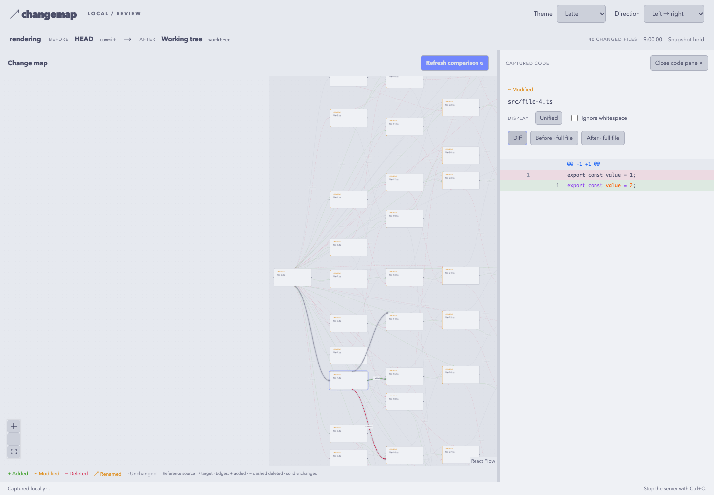

# グラフ配置・描画の性能測定

以下の従来測定は2026-09-23の記録。2026-09-25のTASK-26修正結果は末尾に追記。従来測定の実装commitは `4d0959338f94bf29503e6b8aa8a7a4307e301bac`。再現コマンドは [CONTRIBUTING.md](../../CONTRIBUTING.md)、方式の判断は [設計文書](<doc-2 - architecture.md>) を参照する。

## 測定目標

表示対象100ノード・300辺で初期表示1秒以内、1,000ノード・3,000辺で3秒以内、選択・テーマ変更300ms以内をユーザー承認済み。10,000ノードは限界測定とする。リポジトリ全体の解析ファイル数と、直接近傍抽出後の表示ノード数を区別する。

## 測定方法と結果

`pnpm build`後、`pnpm benchmark:rendering <nodes> [layered|grouped|chain|hub] [screenshot-path] [--mixed-edges]`を実行する。依存は既存のagent-browserとChromiumを利用し、実行時依存は追加しない。専用のloopback fixture serverが実際のdist/uiと合成ReviewSummaryを配信する。ブラウザの初期描画はheadの計測スクリプト開始から、全ノード・辺のDOM準備と2回のrequestAnimationFrameまで。選択・テーマ変更は各5回、同じく2フレーム待って測る。Git取得・解析、GPU描画完了、実ユーザーのINPは含まない。

100/1,000ノードは新しいブラウザセッションで各3回。環境はApple M5、Darwin 25.6.0、Node.js 24.14.1、headless Chromium 153、1440×1000。測定値はこの文書末尾のJSONに保存。測定中の他プロセスをOSレベルで隔離してはいない。

| 形状            | ノード / 辺   | 初期描画       | 選択最大 | テーマ変更最大 |
| --------------- | ------------- | -------------- | -------- | -------------- |
| 階層（3回）     | 100 / 300     | 136.4–145.7 ms | 34.3 ms  | 33.9 ms        |
| 階層（3回）     | 1,000 / 3,000 | 781.6–825.6 ms | 34.6 ms  | 42.4 ms        |
| 依存鎖（1回）   | 1,000 / 999   | 310.5 ms       | 33.5 ms  | 33.7 ms        |
| 集中依存（1回） | 1,000 / 999   | 367.2 ms       | 37.6 ms  | 34.0 ms        |

最適化前の1,000ノードでは初期740.6 ms、選択最大154.8 ms・テーマ最大152.2 ms。最適化の効果は主に表示後の操作にある。初期描画の改善とは主張しない。集中依存のスクリーンショットを確認し、全体表示ではラベルが小さいことを確認した。ズーム・パンが必要であり、1,000ノードすべてを一画面で読めるという保証ではない。

10,000ノード・30,000辺はDagreのスタック上限で失敗した。修正前はブラウザ測定が25秒でタイムアウト。単体配置測定で435 ms後の `RangeError: Maximum call stack size exceeded`、NodeピークRSS 322.6 MiBを確認した。例外処理追加後は10,000ファイルの選択肢を維持し、31 msでコードを開けた。グラフの描画成功には数えず、benchmarkも終了コード1を返す。

`pnpm benchmark:layout 1000` は当日の測定で661 ms / Nodeピーク343 MiB。配置専用プロセスのRSSでありブラウザメモリではない。`pnpm benchmark:analysis 100 10000` は100ファイル37/13 ms・136 MiB、10,000ファイル655/589 ms・741 MiBだった。解析は既存の約143 bytes/ファイルのfixtureで、表示対象は6ファイル。描画1,000ノード測定と混同しない。

制限：同期配置が長時間かかるケースを中断する機能はない。Windows/Linuxのブラウザ描画、任意の密なグラフや大きい実リポジトリを保証する測定ではない。大規模対応の拡張（別配置方式、worker、集約）は初版の対応範囲へ追加していない。

## 生測定値

旧JSONの全データをそのまま以下に保持する。JSONを必要とする場合は、このコードブロックをファイルへ保存する。移管時にJSONとして元データと一致することを確認済み。

```json
{
  "date": "2026-09-23",
  "viewport": [1440, 1000],
  "results": [
    {
      "size": 100,
      "edges": 300,
      "shape": "layered",
      "node": "v24.14.1",
      "os": "darwin 25.6.0",
      "cpu": "Apple M5",
      "sample": "changemap-render-100-1",
      "browser": "Mozilla/5.0 (Macintosh; Intel Mac OS X 10_15_7) AppleWebKit/537.36 (KHTML, like Gecko) HeadlessChrome/153.0.0.0 Safari/537.36",
      "initialMs": 136.40000000037253,
      "interactions": [
        {
          "selectMs": 7,
          "themeMs": 28.700000000186265
        },
        {
          "selectMs": 34,
          "themeMs": 32.700000000186265
        },
        {
          "selectMs": 33,
          "themeMs": 33.90000000037253
        },
        {
          "selectMs": 33.69999999925494,
          "themeMs": 33.200000000186265
        },
        {
          "selectMs": 33.40000000037253,
          "themeMs": 32.799999999813735
        }
      ]
    },
    {
      "size": 100,
      "edges": 300,
      "shape": "layered",
      "node": "v24.14.1",
      "os": "darwin 25.6.0",
      "cpu": "Apple M5",
      "sample": "changemap-render-100-2",
      "browser": "Mozilla/5.0 (Macintosh; Intel Mac OS X 10_15_7) AppleWebKit/537.36 (KHTML, like Gecko) HeadlessChrome/153.0.0.0 Safari/537.36",
      "initialMs": 138.3999999994412,
      "interactions": [
        {
          "selectMs": 13.099999999627471,
          "themeMs": 33.299999999813735
        },
        {
          "selectMs": 32.90000000037253,
          "themeMs": 33.700000000186265
        },
        {
          "selectMs": 33.299999999813735,
          "themeMs": 33.40000000037253
        },
        {
          "selectMs": 32.299999999813735,
          "themeMs": 33.40000000037253
        },
        {
          "selectMs": 34.200000000186265,
          "themeMs": 33.299999999813735
        }
      ]
    },
    {
      "size": 100,
      "edges": 300,
      "shape": "layered",
      "node": "v24.14.1",
      "os": "darwin 25.6.0",
      "cpu": "Apple M5",
      "sample": "changemap-render-100-3",
      "browser": "Mozilla/5.0 (Macintosh; Intel Mac OS X 10_15_7) AppleWebKit/537.36 (KHTML, like Gecko) HeadlessChrome/153.0.0.0 Safari/537.36",
      "initialMs": 145.69999999925494,
      "interactions": [
        {
          "selectMs": 8.700000000186265,
          "themeMs": 33.69999999925494
        },
        {
          "selectMs": 32.30000000074506,
          "themeMs": 33.39999999944121
        },
        {
          "selectMs": 34.299999999813735,
          "themeMs": 33.200000000186265
        },
        {
          "selectMs": 33.40000000037253,
          "themeMs": 33.299999999813735
        },
        {
          "selectMs": 33.200000000186265,
          "themeMs": 33.5
        }
      ]
    },
    {
      "size": 1000,
      "edges": 3000,
      "shape": "layered",
      "node": "v24.14.1",
      "os": "darwin 25.6.0",
      "cpu": "Apple M5",
      "sample": "changemap-render-1000-1",
      "browser": "Mozilla/5.0 (Macintosh; Intel Mac OS X 10_15_7) AppleWebKit/537.36 (KHTML, like Gecko) HeadlessChrome/153.0.0.0 Safari/537.36",
      "initialMs": 825.6000000005588,
      "interactions": [
        {
          "selectMs": 31.5,
          "themeMs": 42.39999999944121
        },
        {
          "selectMs": 32.90000000037253,
          "themeMs": 32.90000000037253
        },
        {
          "selectMs": 34.59999999962747,
          "themeMs": 32.799999999813735
        },
        {
          "selectMs": 33,
          "themeMs": 33.799999999813735
        },
        {
          "selectMs": 33.700000000186265,
          "themeMs": 32.90000000037253
        }
      ]
    },
    {
      "size": 1000,
      "edges": 3000,
      "shape": "layered",
      "node": "v24.14.1",
      "os": "darwin 25.6.0",
      "cpu": "Apple M5",
      "sample": "changemap-render-1000-2",
      "browser": "Mozilla/5.0 (Macintosh; Intel Mac OS X 10_15_7) AppleWebKit/537.36 (KHTML, like Gecko) HeadlessChrome/153.0.0.0 Safari/537.36",
      "initialMs": 808.2999999998137,
      "interactions": [
        {
          "selectMs": 30.09999999962747,
          "themeMs": 28
        },
        {
          "selectMs": 32.799999999813735,
          "themeMs": 33.799999999813735
        },
        {
          "selectMs": 33.80000000074506,
          "themeMs": 32.89999999944121
        },
        {
          "selectMs": 33.40000000037253,
          "themeMs": 33.09999999962747
        },
        {
          "selectMs": 33.700000000186265,
          "themeMs": 33.09999999962747
        }
      ]
    },
    {
      "size": 1000,
      "edges": 3000,
      "shape": "layered",
      "node": "v24.14.1",
      "os": "darwin 25.6.0",
      "cpu": "Apple M5",
      "sample": "changemap-render-1000-3",
      "browser": "Mozilla/5.0 (Macintosh; Intel Mac OS X 10_15_7) AppleWebKit/537.36 (KHTML, like Gecko) HeadlessChrome/153.0.0.0 Safari/537.36",
      "initialMs": 781.5999999996275,
      "interactions": [
        {
          "selectMs": 24.899999999441206,
          "themeMs": 37.60000000055879
        },
        {
          "selectMs": 33.59999999962747,
          "themeMs": 33.5
        },
        {
          "selectMs": 33.799999999813735,
          "themeMs": 32.30000000074506
        },
        {
          "selectMs": 34.299999999813735,
          "themeMs": 32.39999999944121
        },
        {
          "selectMs": 34.200000000186265,
          "themeMs": 33
        }
      ]
    },
    {
      "size": 1000,
      "edges": 999,
      "shape": "chain",
      "node": "v24.14.1",
      "os": "darwin 25.6.0",
      "cpu": "Apple M5",
      "sample": "changemap-render-chain",
      "browser": "Mozilla/5.0 (Macintosh; Intel Mac OS X 10_15_7) AppleWebKit/537.36 (KHTML, like Gecko) HeadlessChrome/153.0.0.0 Safari/537.36",
      "initialMs": 310.5,
      "interactions": [
        {
          "selectMs": 19.700000000186265,
          "themeMs": 33.19999999925494
        },
        {
          "selectMs": 33.10000000055879,
          "themeMs": 33.59999999962747
        },
        {
          "selectMs": 33.299999999813735,
          "themeMs": 32.80000000074506
        },
        {
          "selectMs": 33.5,
          "themeMs": 33.69999999925494
        },
        {
          "selectMs": 33.40000000037253,
          "themeMs": 33.200000000186265
        }
      ]
    },
    {
      "size": 1000,
      "edges": 999,
      "shape": "hub",
      "node": "v24.14.1",
      "os": "darwin 25.6.0",
      "cpu": "Apple M5",
      "sample": "changemap-render-hub",
      "browser": "Mozilla/5.0 (Macintosh; Intel Mac OS X 10_15_7) AppleWebKit/537.36 (KHTML, like Gecko) HeadlessChrome/153.0.0.0 Safari/537.36",
      "initialMs": 367.20000000018626,
      "interactions": [
        {
          "selectMs": 37.59999999962747,
          "themeMs": 29.90000000037253
        },
        {
          "selectMs": 32.69999999925494,
          "themeMs": 34
        },
        {
          "selectMs": 33.5,
          "themeMs": 33.10000000055879
        },
        {
          "selectMs": 33.5,
          "themeMs": 33.200000000186265
        },
        {
          "selectMs": 33.5,
          "themeMs": 33.09999999962747
        }
      ]
    }
  ]
}
```


## 2026-09-25 TASK-26: 非関連エッジの透明度処理を修正

対象は `1c28aa1c7e46af5604a08b296beb6a31dde19f12` に対する作業ツリーの修正。SVGグループ全体のopacityを廃止し、線・矢印には12%のアルファを含む同一色、変更ラベルと背景には個別のfill-opacityを適用する。円の径・間隔・速度、端のフェード、発光、ホバー優先、動きを減らす設定、300ms目標は変更していない。重なり部分はグループ一括合成から各描画要素のアルファ合成に変わるため、ピクセル単位の完全一致を意図する変更ではない。

環境: Apple M5、Darwin 25.6.0、Node.js 24.14.1、headless Chromium 154、1440×1000。初期描画と操作は従来と同じ2フレーム近似。操作完了や実ユーザーINP、継続アニメーションのフレームレートを保証する測定ではない。

| 条件 | 初期描画 | 選択最大 | テーマ切替最大 | ノードホバー | エッジホバー | 判定 |
| --- | ---: | ---: | ---: | ---: | ---: | --- |
| grouped 1,000 / 3,000 / 41ディレクトリ・3回 | 363.2–375.5ms | 121.8ms | 50.2ms | 75.6ms | 67.0ms | 成功 |
| layered 1,000 / 3,000・1回 | 745.0ms | 113.9ms | 52.6ms | 74.9ms | 68.7ms | 成功 |
| hub 1,000 / 999・修正後 | 329.4ms | 1,432.0ms | 43.0ms | 71.1ms | 61.0ms | 未達 |
| hub 1,000 / 999・変更前HEAD | 327.9ms | 1,387.1ms | 50.7ms | 38.5ms | 37.5ms | 未達 |

PR #13で報告されていたgroupedの未達は解消。hubは変更前HEADを一時ディレクトリでビルドしても再現する別の残存問題であり、性能目標全体を達成したとは扱わない。生成物だけでマスク・発光を外した切り分けでは操作時間が短縮したが、要件を変えるため採用せず復元した。hubの改善はこの透明度修正には含まない。

追加の回帰検証: `pnpm benchmark:rendering 40 layered [screenshot-path] --mixed-edges`。従来の性能fixtureは維持し、このオプション指定時だけ通常・追加・削除線を混在させる。Mocha/Latteの両方で、線と矢印の実際に解決された色・アルファ、ラベルと背景のfill-opacity、削除線の破線、ホバー優先と選択状態への復帰をブラウザーで検査する。SVGグループのopacity再導入も検出する。円の移動・マスク・動きを減らす設定の既存検査も通過した。



静的検査・全129テスト・配布検証成功。配置測定はlayered 783.0ms、grouped 89.9ms。ブラウザーエラーなし。Windows/Linux・他ブラウザーでの描画性能は未測定。

### TASK-26修正の生測定値

```json
{
  "grouped-1": [
    {
      "size": 1000,
      "edges": 3000,
      "directories": 41,
      "shape": "grouped",
      "node": "v24.14.1",
      "os": "darwin 25.6.0",
      "cpu": "Apple M5",
      "bundle": "/Users/mitani/ghq/github.com/tapioca24/changemap/dist/ui/"
    },
    {
      "started": 9.5,
      "ready": true,
      "initialMs": 375.5,
      "browser": "Mozilla/5.0 (Macintosh; Intel Mac OS X 10_15_7) AppleWebKit/537.36 (KHTML, like Gecko) HeadlessChrome/154.0.0.0 Safari/537.36"
    },
    {
      "timings": [
        {
          "selectMs": 121.5,
          "themeMs": 34.29999998211861
        },
        {
          "selectMs": 100.59999999403954,
          "themeMs": 32.80000001192093
        },
        {
          "selectMs": 100.5,
          "themeMs": 32.69999998807907
        },
        {
          "selectMs": 101.10000002384186,
          "themeMs": 32.29999998211861
        },
        {
          "selectMs": 100.7000000178814,
          "themeMs": 49.5
        }
      ]
    },
    {
      "hover": {
        "nodeMs": 74.69999998807907,
        "nodeEdges": 36,
        "edgeMs": 63.80000001192093,
        "edgeCount": 1
      }
    },
    {
      "dots": {
        "moved": 9.335999999999999
      }
    },
    {
      "reducedMotion": {
        "enabled": true,
        "dotsHidden": true,
        "edgeStillActive": true
      }
    },
    {
      "targetPassed": true,
      "initialLimitMs": 3000,
      "interactionLimitMs": 300
    },
    {
      "browserErrors": []
    }
  ],
  "grouped-2": [
    {
      "size": 1000,
      "edges": 3000,
      "directories": 41,
      "shape": "grouped",
      "mixedEdges": false,
      "node": "v24.14.1",
      "os": "darwin 25.6.0",
      "cpu": "Apple M5",
      "bundle": "/Users/mitani/ghq/github.com/tapioca24/changemap/dist/ui/"
    },
    {
      "started": 9.599999994039536,
      "ready": true,
      "initialMs": 369.40000000596046,
      "browser": "Mozilla/5.0 (Macintosh; Intel Mac OS X 10_15_7) AppleWebKit/537.36 (KHTML, like Gecko) HeadlessChrome/154.0.0.0 Safari/537.36"
    },
    {
      "timings": [
        {
          "selectMs": 121.5,
          "themeMs": 37.599999994039536
        },
        {
          "selectMs": 99.90000000596046,
          "themeMs": 34.599999994039536
        },
        {
          "selectMs": 98.19999998807907,
          "themeMs": 33.099999994039536
        },
        {
          "selectMs": 102.30000001192093,
          "themeMs": 30.900000005960464
        },
        {
          "selectMs": 100.69999998807907,
          "themeMs": 50.20000001788139
        }
      ]
    },
    {
      "hover": {
        "nodeMs": 75.59999999403954,
        "nodeEdges": 36,
        "edgeMs": 67,
        "edgeCount": 1
      }
    },
    {
      "dots": {
        "moved": 9.336
      }
    },
    {
      "appearance": {
        "selectionRestored": true,
        "statuses": [
          "unchanged"
        ],
        "themes": [
          "mocha",
          "latte"
        ]
      }
    },
    {
      "reducedMotion": {
        "enabled": true,
        "dotsHidden": true,
        "edgeStillActive": true
      }
    },
    {
      "targetPassed": true,
      "initialLimitMs": 3000,
      "interactionLimitMs": 300
    },
    {
      "browserErrors": []
    }
  ],
  "grouped-3": [
    {
      "size": 1000,
      "edges": 3000,
      "directories": 41,
      "shape": "grouped",
      "mixedEdges": false,
      "node": "v24.14.1",
      "os": "darwin 25.6.0",
      "cpu": "Apple M5",
      "bundle": "/Users/mitani/ghq/github.com/tapioca24/changemap/dist/ui/"
    },
    {
      "started": 8,
      "ready": true,
      "initialMs": 363.2000000178814,
      "browser": "Mozilla/5.0 (Macintosh; Intel Mac OS X 10_15_7) AppleWebKit/537.36 (KHTML, like Gecko) HeadlessChrome/154.0.0.0 Safari/537.36"
    },
    {
      "timings": [
        {
          "selectMs": 121.7999999821186,
          "themeMs": 36.20000001788139
        },
        {
          "selectMs": 100.59999999403954,
          "themeMs": 33
        },
        {
          "selectMs": 100.19999998807907,
          "themeMs": 32.900000005960464
        },
        {
          "selectMs": 100.2000000178814,
          "themeMs": 33.099999994039536
        },
        {
          "selectMs": 100.69999998807907,
          "themeMs": 49.400000005960464
        }
      ]
    },
    {
      "hover": {
        "nodeMs": 74,
        "nodeEdges": 36,
        "edgeMs": 64,
        "edgeCount": 1
      }
    },
    {
      "dots": {
        "moved": 10.672
      }
    },
    {
      "appearance": {
        "selectionRestored": true,
        "statuses": [
          "unchanged"
        ],
        "themes": [
          "mocha",
          "latte"
        ]
      }
    },
    {
      "reducedMotion": {
        "enabled": true,
        "dotsHidden": true,
        "edgeStillActive": true
      }
    },
    {
      "targetPassed": true,
      "initialLimitMs": 3000,
      "interactionLimitMs": 300
    },
    {
      "browserErrors": []
    }
  ],
  "layered": [
    {
      "size": 1000,
      "edges": 3000,
      "directories": 1,
      "shape": "layered",
      "mixedEdges": false,
      "node": "v24.14.1",
      "os": "darwin 25.6.0",
      "cpu": "Apple M5",
      "bundle": "/Users/mitani/ghq/github.com/tapioca24/changemap/dist/ui/"
    },
    {
      "started": 8.299999982118607,
      "ready": true,
      "initialMs": 745,
      "browser": "Mozilla/5.0 (Macintosh; Intel Mac OS X 10_15_7) AppleWebKit/537.36 (KHTML, like Gecko) HeadlessChrome/154.0.0.0 Safari/537.36"
    },
    {
      "timings": [
        {
          "selectMs": 113.89999997615814,
          "themeMs": 52.60000002384186
        },
        {
          "selectMs": 103.69999998807907,
          "themeMs": 44.30000001192093
        },
        {
          "selectMs": 99.69999998807907,
          "themeMs": 48.30000001192093
        },
        {
          "selectMs": 100.5,
          "themeMs": 49.599999994039536
        },
        {
          "selectMs": 100.5,
          "themeMs": 48.900000005960464
        }
      ]
    },
    {
      "hover": {
        "nodeMs": 74.90000000596046,
        "nodeEdges": 36,
        "edgeMs": 68.69999998807907,
        "edgeCount": 1
      }
    },
    {
      "dots": {
        "moved": 9.328
      }
    },
    {
      "appearance": {
        "selectionRestored": true,
        "statuses": [
          "unchanged"
        ],
        "themes": [
          "mocha",
          "latte"
        ]
      }
    },
    {
      "reducedMotion": {
        "enabled": true,
        "dotsHidden": true,
        "edgeStillActive": true
      }
    },
    {
      "targetPassed": true,
      "initialLimitMs": 3000,
      "interactionLimitMs": 300
    },
    {
      "browserErrors": []
    }
  ],
  "hub": [
    {
      "size": 1000,
      "edges": 999,
      "directories": 1,
      "shape": "hub",
      "mixedEdges": false,
      "node": "v24.14.1",
      "os": "darwin 25.6.0",
      "cpu": "Apple M5",
      "bundle": "/Users/mitani/ghq/github.com/tapioca24/changemap/dist/ui/"
    },
    {
      "started": 8.699999988079071,
      "ready": true,
      "initialMs": 329.40000000596046,
      "browser": "Mozilla/5.0 (Macintosh; Intel Mac OS X 10_15_7) AppleWebKit/537.36 (KHTML, like Gecko) HeadlessChrome/154.0.0.0 Safari/537.36"
    },
    {
      "timings": [
        {
          "selectMs": 102.90000000596046,
          "themeMs": 43
        },
        {
          "selectMs": 1432,
          "themeMs": 29.80000001192093
        },
        {
          "selectMs": 50.400000005960464,
          "themeMs": 32.39999997615814
        },
        {
          "selectMs": 50.5,
          "themeMs": 32.599999994039536
        },
        {
          "selectMs": 50.599999994039536,
          "themeMs": 36.400000005960464
        }
      ]
    },
    {
      "hover": {
        "nodeMs": 71.09999999403954,
        "nodeEdges": 999,
        "edgeMs": 61,
        "edgeCount": 1
      }
    },
    {
      "dots": {
        "moved": 9.328
      }
    },
    {
      "appearance": {
        "selectionRestored": true,
        "statuses": [
          "unchanged"
        ],
        "themes": [
          "mocha",
          "latte"
        ]
      }
    },
    {
      "reducedMotion": {
        "enabled": true,
        "dotsHidden": true,
        "edgeStillActive": true
      }
    },
    {
      "targetPassed": false,
      "initialLimitMs": 3000,
      "interactionLimitMs": 300
    },
    {
      "browserErrors": []
    }
  ],
  "hub-before-fix": [
    {
      "size": 1000,
      "edges": 999,
      "directories": 1,
      "shape": "hub",
      "node": "v24.14.1",
      "os": "darwin 25.6.0",
      "cpu": "Apple M5",
      "bundle": "/private/var/folders/v8/qnvn664d0b9b1z70_gtn0krm0000gn/T/changemap-baseline-g62771tq/dist/ui/"
    },
    {
      "started": 8,
      "ready": true,
      "initialMs": 327.90000000596046,
      "browser": "Mozilla/5.0 (Macintosh; Intel Mac OS X 10_15_7) AppleWebKit/537.36 (KHTML, like Gecko) HeadlessChrome/154.0.0.0 Safari/537.36"
    },
    {
      "timings": [
        {
          "selectMs": 102.7000000178814,
          "themeMs": 50.69999998807907
        },
        {
          "selectMs": 1387.0999999940395,
          "themeMs": 28.599999994039536
        },
        {
          "selectMs": 50.400000005960464,
          "themeMs": 32.5
        },
        {
          "selectMs": 50.70000001788139,
          "themeMs": 32.79999998211861
        },
        {
          "selectMs": 50.099999994039536,
          "themeMs": 33.10000002384186
        }
      ]
    },
    {
      "hover": {
        "nodeMs": 38.5,
        "nodeEdges": 999,
        "edgeMs": 37.5,
        "edgeCount": 1
      }
    },
    {
      "dots": {
        "moved": 9.336
      }
    },
    {
      "reducedMotion": {
        "enabled": true,
        "dotsHidden": true,
        "edgeStillActive": true
      }
    },
    {
      "targetPassed": false,
      "initialLimitMs": 3000,
      "interactionLimitMs": 300
    },
    {
      "browserErrors": []
    }
  ],
  "mixed-edges": [
    {
      "size": 40,
      "edges": 120,
      "directories": 1,
      "shape": "layered",
      "mixedEdges": true,
      "node": "v24.14.1",
      "os": "darwin 25.6.0",
      "cpu": "Apple M5",
      "bundle": "/Users/mitani/ghq/github.com/tapioca24/changemap/dist/ui/"
    },
    {
      "started": 23.799999982118607,
      "ready": true,
      "initialMs": 135.2000000178814,
      "browser": "Mozilla/5.0 (Macintosh; Intel Mac OS X 10_15_7) AppleWebKit/537.36 (KHTML, like Gecko) HeadlessChrome/154.0.0.0 Safari/537.36"
    },
    {
      "timings": [
        {
          "selectMs": 17.30000001192093,
          "themeMs": 28.30000001192093
        },
        {
          "selectMs": 33.79999998211861,
          "themeMs": 32.5
        },
        {
          "selectMs": 34.20000001788139,
          "themeMs": 33.19999998807907
        },
        {
          "selectMs": 33.099999994039536,
          "themeMs": 33.599999994039536
        },
        {
          "selectMs": 32.5,
          "themeMs": 34.10000002384186
        }
      ]
    },
    {
      "hover": {
        "nodeMs": 30.900000005960464,
        "nodeEdges": 36,
        "edgeMs": 34.19999998807907,
        "edgeCount": 1
      }
    },
    {
      "dots": {
        "moved": 9.336
      }
    },
    {
      "longEdge": {
        "length": 1926.0576171875
      }
    },
    {
      "appearance": {
        "selectionRestored": true,
        "statuses": [
          "unchanged",
          "added",
          "deleted"
        ],
        "themes": [
          "mocha",
          "latte"
        ]
      }
    },
    {
      "reducedMotion": {
        "enabled": true,
        "dotsHidden": true,
        "edgeStillActive": true
      }
    },
    {
      "targetPassed": true,
      "initialLimitMs": 1000,
      "interactionLimitMs": 300
    },
    {
      "browserErrors": []
    }
  ]
}
```
